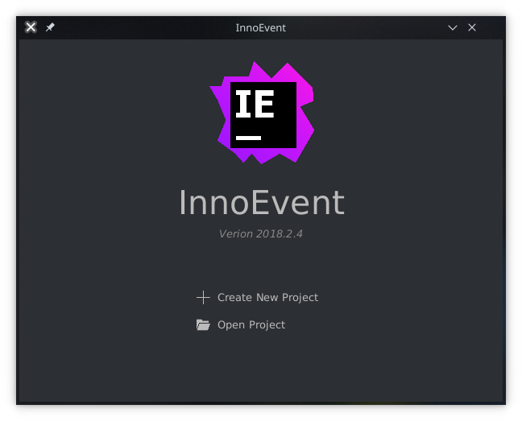
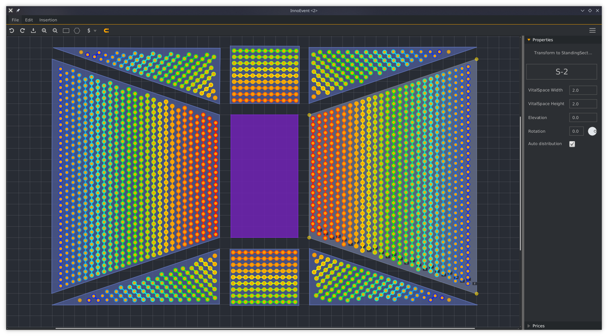

# InnoEvent  

## Software

<p align="center">
  
  
</p>

### Laval GLO-2004 : Génie logiciel orienté objet

This project was done under the "Génie logiciel orienté objet" class at the Laval University - Quebec.  

### Project

InnoEvent is an event creation software that allows you to define the seating plan for concerts, ballets and sports matches for
example.  
This software allows to configure the room plan of different ways through its different features.  
You can find the subject (in French) at the root directory.
  
### Room sections

Thus, it is possible to add sections spread around a single scene. These sections can be general admission sections (standing) or seat sections. For these two categories of section, two types can be distinguished: regular sections corresponding to rectangular-shaped sections and irregular sections corresponding to sections of any shape.  
  
### Places pricing

After representing your room with the stage and its multiple sections, different options for prices are available. First of all, it is possible to assign prices manually in choosing to associate a price with one or more seats, one or more rows see even one or more sections.  
For this option, quote the price for a seat and associate a colour if the price has never been awarded.  
Otherwise, the price distribution can be automated. So, you just have to indicate the income total of the sale, the minimum price and / or the maximum price for a seat.  
The price distribution is then automatically performed according to the position from the seat to the center of the stage. In addition, for each seat (s), row (s) or section (s), an association with one or more offers is feasible.
These offers can be created, modified, added, deleted by the user. 
The user chooses the attribution of these offers according to his desires and the income total desired.  
  
This software makes it possible to have a room plan in accordance with the reality with a precise disposition of our elements, a distribution of prices flexible according to our wishes and a management of effective offers.

### Features

- **Project**
  - Show recent projects
  - Interactive project creation
  - Open saved project
  - {Save / Save as} with state saving (per example ask user if he didn't save and want exit)
  - JSON export (compatible with our website)
  - Dynamic sidebar according to selection (Room / Section / Scene / Row / Seat)
  - Error handling for all forms
- **Room**
  - Resize
  - Rename
  - Undo / Redo (Command pattern implementation, 10k buffer by default)
  - Zoom in / out
  - Scene creation / delete
  - Activate / disable magnetism
  - Automatic rectangular section rotation and irregular row distribution while moving scene
  - Bounds handling (keep all element in room boundaries)
- **Sections**
  - Custom name
  - Interactive creation
  - Delete
  - Move whole section
  - Resize by points
  - Automatic row and seat place compute and refresh when moving or resizing
  - Custom vital space
  - Set {Columns, Row, Elevation, Vital space{Width, Height}} number
  - Automatic rotation with scene
  - Custom rotation
  - Enable / Disable auto distribution
  - Transform standing to sitting and vice-versa
  - Collision indicator
  - Magnetism between lines and {Scene, Sections}
  - Shape prediction of section position with automatic rotation while resizing
- **Seat**
  - Edit seat infos (price, colour)
  - Assign seat offer
  - Unassign seat offer
- **Offer**
  - Create
  - Delete
  - Edit infos (reduction, reductionType, description)
  - Add OfferCondition to an offer
  - Edit OfferCondition infos (description, logicalOperator)
  - Add OfferConditioOperation to an offer
  - Edit OfferConditioOperation infos (value, logicalOperator, relationalOperator)
  - Reduction with percentage or amount
  - Can cumulate infinite conditions, endless possibilities
  - Link to {Section, Row, Seat}
- **Conditions**
  - Create
  - Delete
  - {Inferior, inferior_or_equals,  superior, superior_or_equals, equals} Relational operators
  - {And, or, not} logical operators
- **Price**
  - Link to {Sections, Rows, Seats}
  - Price can be link to a colour
  - Automatic room price actualisation while changing price color
  - Automatic price calculation by {Sections, Rows, Seats} with unique colour indicator per price

## Graphical Engine

InnoEvent was design with modularity in mind so the graphical engine can be totally separated from the program and can be used as a library: [jfx-ShapeEngine](https://github.com/remigastaldi/jfx-ShapeEngine)

## Website

InnoEvent software has the possibility to export a room to JSON and can be import in website we made for place selling: 
[Website](https://innoevent.ga)   
[Website sources](https://github.com/MrDarkSkil/InnoEvent-Website)

## Pricing service

Our pricing gestion is developed as a service so it can be separated from our project: 
[PlacePricingService](https://github.com/MrDarkSkil/PlacePricing-Service)

## Validator service

This validator class is aim to handle forms errors, we developed it as a service so it can be separated from our project as well: 
[Validator](https://github.com/MrDarkSkil/Validator)

## Run the project

Ensure to have java8 with javaFX on you computer.

### With sources

First, generate gradle wrapper with:
```
gradle wrapper
```

#### Directly run software

```bash
./gradlew jfxrun 
```

#### Build jar from source

```bash
./gradlew jfxjar
```

Now you can run the jar under build/jfx/app with:

```bash
java -jar project-jfx.jar
```

#### Build native binary

```bash
./gradlew jfxnative
```

The native binary is under build/jfx/native/InnoEvent/
